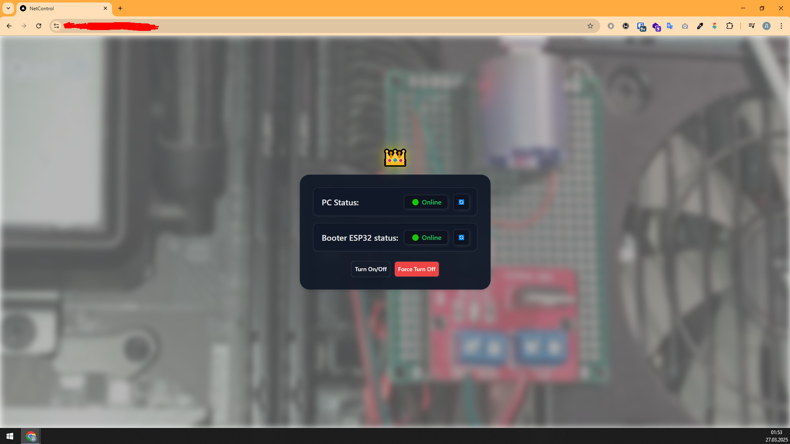
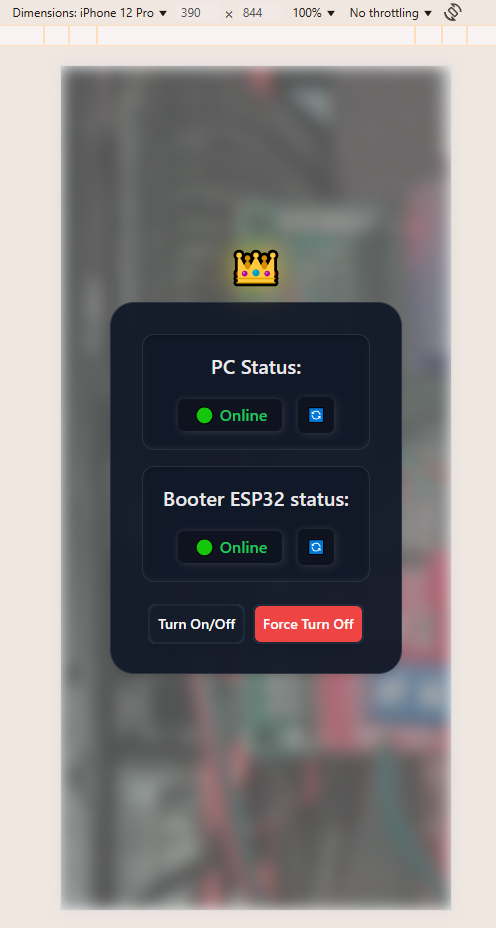
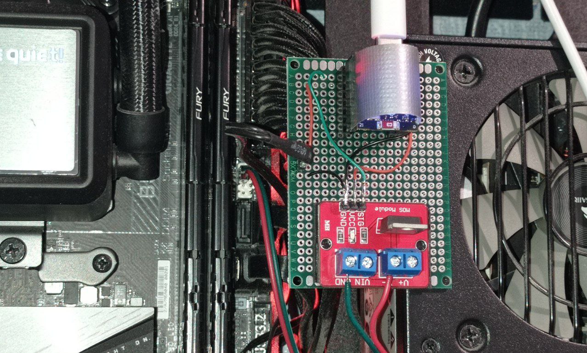

# NetControl

This is my personal project I use to remotely boot or turn off my PC by triggering the power pins of my PC's motherboard with a ESP32 board and a simple WEB interface built with Next.js. It's deployed on my home server. I post it here as a part of my portfolio. Feel free to use it though if you find it usefull.

## Screenshots

### Desktop View
The main dashboard interface in desktop view shows a clean, dark-themed layout with status cards for both PC and ESP32 device. The cards display online/offline status with visual indicators and refresh buttons. Power control buttons are positioned at the bottom. A decorative crown emoji adds a playful touch above the interface.

### Mobile View
The mobile interface maintains the same functionality while adapting to smaller screens. Status cards stack vertically with their contents aligned centrally for better readability on mobile devices.

## Project Overview
The system consists of:
- A Next.js web interface
- An ESP32 microcontroller that interfaces with the PC's motherboard power button pins with a MOSSFET
- A ping service running on the target PC for status monitoring

### Hardware Components
The ESP32 board is connected to the PC's power button pins through a MOSFET module, which acts as a solid-state relay. This allows the web interface to safely control the PC's power state.

The MOSFET module is connected to GPIO 3 on the ESP32. For detailed wiring instructions and pin configuration, see the [firmware documentation](firmware/README.md).

## Project Structure
The project is split into three main components:

1. **Web Interface** (`/web-interface`)
   - Next.js-based web application for controlling the PC
   - Provides a user-friendly interface for power management
   - Handles authentication and user interactions

2. **ESP32 Firmware** (`/esp32`)
   - Microcontroller code that interfaces with the PC's power pins
   - Handles the physical control of the PC (simulates power button press with a mossfet module)
   - Communicates with the web interface

3. **Ping Service** (`/ping`)
   - Lightweight Node.js service for PC status monitoring
   - Runs on the target PC
   - Provides online/offline status to the web interface

## TODO
Estimated development time: 12-17 hours

- Implement session access and refresh tokens for better security (4-6h)
- Add tests (6-8h)
- Improve login view with better styling and user feedback (2-3h)

## License
I built this project for personal use and share it as part of my portfolio. Feel free to use it. It's provided "as is" without any warranty.
